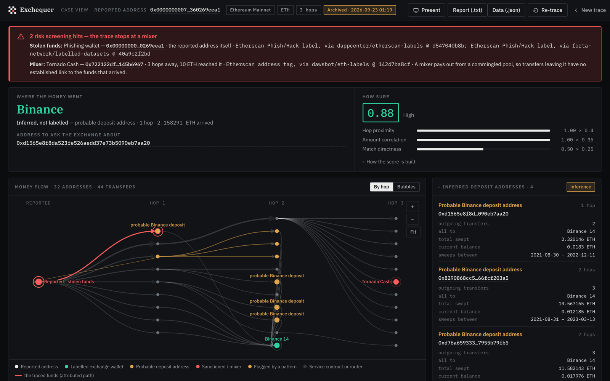
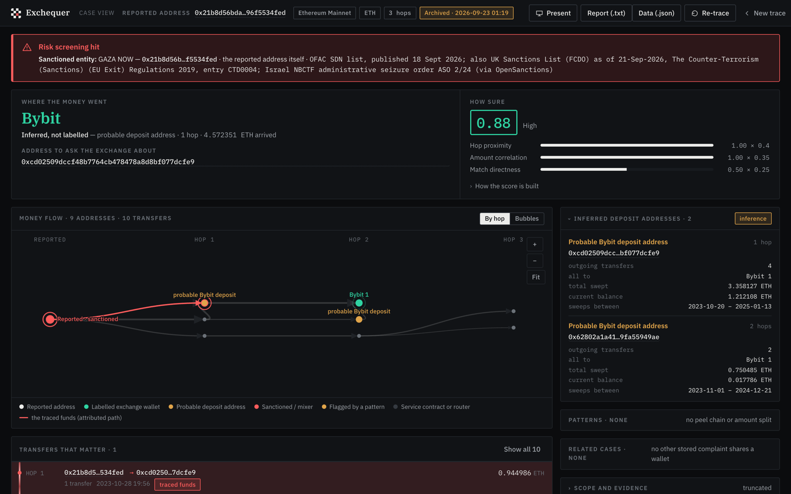
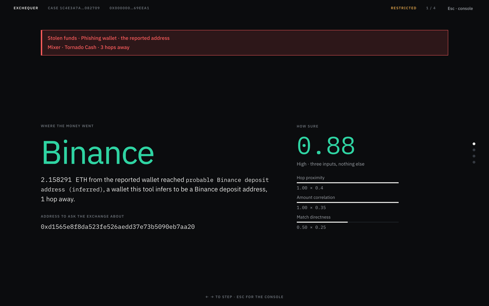
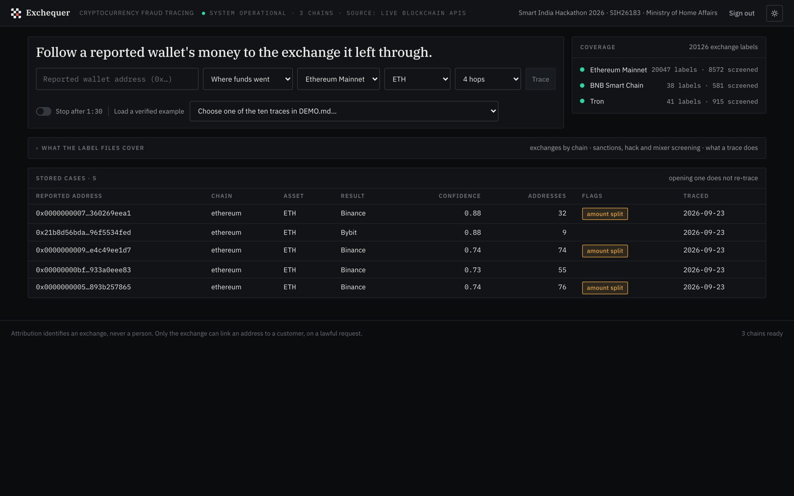
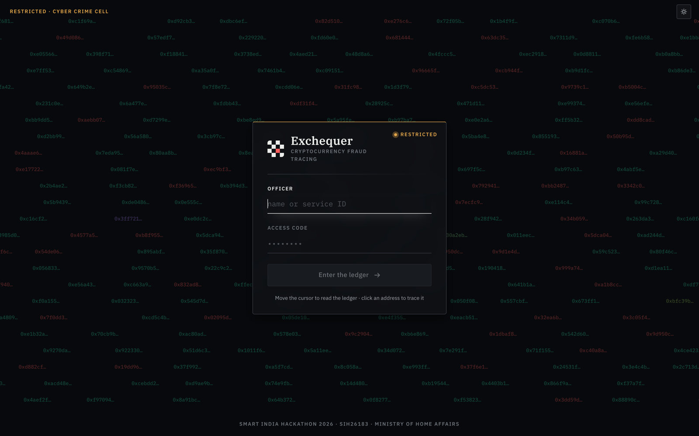

<div align="center">

<picture>
  <source media="(prefers-color-scheme: dark)" srcset="docs/assets/exchequer-banner-dark.svg">
  
</picture>

### Trace a reported crypto-fraud wallet to the exchange it was cashed out through — with every step a human can re-check by hand.

[](https://github.com/sidhy4rth/Exchequer/actions/workflows/test.yml)
[](https://exchequer-production.up.railway.app)


[**Live demo**](https://exchequer-production.up.railway.app) ·
[**Demo guide**](DEMO.md) ·
[**Research & sources**](RESEARCH.md) ·
[**Judge Q&A**](JUDGE_QA.md)

</div>

<br>

<p align="center">
  
</p>
<p align="center"><sub>A reported phishing wallet (DEMO.md trace 6). Its money reaches a probable Binance deposit address in one hop — the address a lawful request should name — while another branch puts 10 ETH into Tornado Cash, where the trace stops rather than invent a trail.</sub></p>

---

## At a glance

<table>
<tr>
<td align="center"><h3>44,857</h3>labelled addresses</td>
<td align="center"><h3>25,362</h3>exchange addresses<br><sub>incl. 24,018 Bitget and Binance<br>customer deposit addresses</sub></td>
<td align="center"><h3>6</h3>governments' sanctions<br>and seizure lists</td>
<td align="center"><h3>10,352</h3>addresses Tether<br>has frozen</td>
<td align="center"><h3>8,953</h3>hack, phishing and<br>scam wallets</td>
<td align="center"><h3>5</h3>chains, 14 assets</td>
<td align="center"><h3>295</h3>tests, no network</td>
</tr>
</table>

Built for **Smart India Hackathon 2026**, problem statement **SIH26183** (Ministry of Home Affairs).

A victim reports one wallet address. Exchequer follows the money outward hop by hop, screens every
address it passes against sanctions lists, mixers and known theft, flags laundering shapes along the
way, identifies the exchange where the funds landed — down to the customer deposit address where it
can — and produces a report an investigator can attach to a legal request.

**Why Ethereum, BNB Chain and Tron.** The choice follows the published evidence rather than a hunch: Chainalysis
measured stablecoins at 63% of illicit transaction volume in 2024 and 84% in 2025; TRM Labs measured 58%
of 2024 illicit volume on Tron (a share that halved in 2025); and the UN Office on Drugs and Crime
describes USDT on Tron as the "preferred choice" of the Southeast-Asian cyber-fraud operations that
target Indian victims. No published source measures the cash-out rails for Indian scam proceeds
specifically, so this README does not claim one. Every figure is quoted from its source in
[RESEARCH.md](RESEARCH.md).

**Polygon and Arbitrum** came later, and cheaply: they are the two chains besides Ethereum that the free
Etherscan tier serves, so they run on the same key and the same code. Their labels are carried over from
Ethereum — an exchange's hot wallet is one private key, and one key controls the same address on every EVM
chain — and each address was kept only if it has no contract code on the new chain and has *sent* a
transaction there, which only the key holder can do (`scripts/port_evm_labels.py`). That gives 139 wallets of
53 exchanges on Polygon, 8 of them CoinDCX's, and 106 of 43 on Arbitrum, plus the sanctioned accounts that
pass the same test (15 and 9). Base and Optimism need a paid plan and are not covered.

**The design principle is auditability.** Every attribution is an exact match against a published
address in a data file you can open and read. Every laundering finding is a handful of arithmetic
comparisons that prints the thresholds it applied. There is no model, no clustering and no proprietary
score — a conclusion that reaches a courtroom has to be one a human can re-check by hand.

---

## What it does

| | |
|---|---|
| **Follows the money** | Breadth-first, both directions: *where did it go* and *who paid this wallet*. One asset per trace — ETH, BNB, TRX, USDT or USDC — so every amount in a graph is comparable. |
| **Names the exchange** | Exact match against 25,362 exchange addresses on five chains, including **CoinDCX** and **Delta Exchange** — and 24,018 per-customer deposit addresses at **Bitget** and **Binance**, each of which names one account. |
| **Infers the deposit address** | An unlabelled wallet whose every outflow sweeps to one exchange wallet is reported as that exchange's *probable* deposit address — the address a request has to name — and scored lower than a label match. |
| **Screens every hop** | Against the sanctions and seizure lists of the **US, UK, EU, Israel, Japan and France**; **every address Tether has frozen on USDT**, read from the contract itself; mixer pools (Tornado Cash, Typhoon, Privacy Pools); and 8,953 wallets tied to hacks (WazirX, Bybit, BingX, Ronin…) and reported phishing. |
| **Stops at a mixer** | A mixer pays out from a commingled pool, so the trace ends there and says so instead of manufacturing a trail. |
| **Flags laundering shapes** | Peel chains and amount splits, as fixed rules that print their thresholds — measured on 88 real wallets, and never allowed to move the score. |
| **Follows the money through a swap** | A transfer into a known DEX router is read from its receipt; if it came back as USDT or USDC, that stablecoin is traced onward from the moment of the swap, as its own linked trace. |
| **Links complaints** | Stored cases whose money converges on the same wallets are shown as one operation, with no new API calls. |
| **Drafts the request** | One click drafts the letter to the exchange — the address to ask about, every hop with amounts, times and transaction hashes, the evidence hash — and, where USDT or a Tether freeze is involved, the letter to Tether. The officer's details and the legal provision are left blank to complete. |
| **Seals the evidence** | Every provider response is hashed as it arrives; the report carries the manifest and a content hash, so a changed byte is detectable. |

<table>
<tr>
<td width="50%"><br><sub><b>Three governments, one wallet</b> — the reported address is on the OFAC, UK and Israeli lists; the alert names each entry.</sub></td>
<td width="50%"><br><sub><b>Present mode</b> — the same case as four projector screens: the finding, the route, what was left out, the handoff.</sub></td>
</tr>
<tr>
<td width="50%"><br><sub><b>Intake</b> — address, direction, chain, asset and depth; coverage per chain; stored cases that open without re-tracing.</sub></td>
<td width="50%"><br><sub><b>The ledger</b> — the demo sign-in drifts over the real addresses the tool knows: sanctioned and flagged in red, each exchange in its own colour.</sub></td>
</tr>
</table>

---

## How it works

```
  reported address
        │
        ▼
  ┌───────────────┐   Picks the provider for the chosen chain + asset
  │ chain_data.py │   Ethereum → Etherscan  BSC → NodeReal  Tron → TronGrid
  └───────┬───────┘   All rate-limit aware, retrying with backoff
          ▼
  ┌───────────────┐   BFS, depth-limited (default 4 hops), in either direction
  │ graph_        │   outgoing → where the money went (default)
  │ builder.py    │   incoming → who funded this address
  └───────┬───────┘   Highest-value branches first; drops dust; time-windowed
          ▼
  ┌───────────────┐   Exact lookup against that chain's own label file
  │ exchange_     │   (labels are never shared between chains)
  │ matcher.py    │   + deposit_inference.py for probable deposit addresses
  └───────┬───────┘
          ▼
  ┌───────────────┐   Six governments' sanctions/seizure lists, Tether's
  │ risk_         │   USDT freezes, then mixer pools and hack/phishing
  │ matcher.py    │   wallets. Government first; always stops at a mixer.
  └───────┬───────┘
          ▼
  ┌───────────────┐   Peel chain + amount split, as explainable fixed rules
  │ pattern_      │   swap_detection.py reads receipts at DEX routers
  │ detection.py  │
  └───────┬───────┘
          ▼
  ┌───────────────┐   hop proximity (40%) + amount correlation (35%)
  │ scoring.py    │   + match directness (25%)
  └───────┬───────┘
          ▼
   graph + exchange + confidence + screening + flags ──► SQLite ──► sealed report
```

---

## Quick start

**Prerequisites:** Python 3.11+, Node.js 20+, and free API keys — **Etherscan** (Ethereum, required),
**NodeReal** (BNB Smart Chain, optional), **TronGrid** (Tron, optional; keyless requests are throttled
to about one every 1.2 seconds) and **TronScan** (optional; lets Tron traces read TronScan's tags live).

```bash
# backend
cd backend
python3 -m venv .venv && source .venv/bin/activate   # Windows: .venv\Scripts\activate
pip install -r requirements.txt
cp .env.example .env                                  # paste your keys
python -m scripts.check_etherscan                     # prints live transactions if the key works
uvicorn app.main:app --reload --port 8000

# frontend, in a second terminal
cd frontend
npm install
npm run dev                                           # → http://localhost:5173
```

The first screen is a demo sign-in: **`admin` / `admin`**. It is a front door for the demonstration, not
access control — the backend has no accounts and the API answers without it.

<details>
<summary><b>Getting an Etherscan key, and other setup notes</b></summary>

1. Go to <https://etherscan.io/apis> and create a free account.
2. Sign in, open **API Keys** in the left sidebar, click **Add**, and copy the key into `backend/.env`.

The free tier allows ~5 requests/second and 100,000/day. Exchequer self-throttles below that and backs off
automatically, so a demo will not die mid-trace. It uses Etherscan's **V2** multi-chain endpoint
(`api.etherscan.io/v2/api?chainid=1`); the old V1 per-chain hosts are retired.

- Check the backend: <http://127.0.0.1:8000/health> — `etherscan_key_configured` must be `true`.
  Interactive API docs: <http://127.0.0.1:8000/docs>.
- Use `localhost`, not `127.0.0.1`, for the frontend: Vite binds to IPv6 `[::1]` by default. Run
  `npm run dev -- --host 127.0.0.1` if you need IPv4.
- The frontend calls `/api/*`, which Vite proxies to port 8000, so nothing needs configuring.
- **Serving the UI from FastAPI instead** (one origin, no Vite): `cd frontend && VITE_API_BASE="" npm run build`.
  A plain `npm run build` bakes in the dev-mode `/api` prefix, which only the Vite proxy rewrites. The
  Dockerfile sets this already.

</details>

<details>
<summary><b>A tour of the interface</b></summary>

The interface answers first and shows evidence on demand. The home page is the address form with the ten
`DEMO.md` traces in a dropdown, one line of coverage per chain, and the stored cases. A case opens as: a red
banner if any address is sanctioned, a mixer or a known thief's; one finding bar — where the money went, the
address to cite, how sure (the score with its three inputs; the working one click away); then the money flow
drawn by hop, the reported address on the left and whatever it reached on the right, the attributed path the
one bold line, every other transfer thin (the force-directed bubble view is a toggle); beneath it only the
transfers that matter, with the full list one click away; and on the right, one folded section each for
inferred deposit addresses, patterns, swaps, related cases, funders and scope. **Present** (or the P key) shows
the case as four projector screens, stepped with the arrow keys; Esc returns to the console. Every address
copies itself when clicked. Dark console skin by default; a paper case-file skin is one click away.

Behind the sign-in form drifts the ledger the tool knows (`GET /ledger`), every address real — sanctioned and
flagged addresses in red, each exchange's wallets in its own colour, probable deposit addresses dotted, stored
cases' intermediaries in grey. Clicking an address traces it to the nearest exchange wallet, or says none was
within reach.

The mark is a chequer. The Exchequer was named for the chequered cloth on which the Crown's money was counted,
square by square; one square is red — the sum being traced.

</details>

---

## Try it

Real mainnet addresses that produce real attributions — pick the **chain** and **asset** to match the row.
[DEMO.md](DEMO.md) has ten more, each re-verified cold with what to say about it.

| Chain / asset | Address | What you get |
|---|---|---|
| Ethereum · ETH | `0x60d02e0956e2f3795167c15ba61ab452c85c2533` | **Best demo.** 48 addresses at 4 hops, ~28 s / 31 requests cold; a **probable Bitget deposit address** in 1 hop (0.875), with Binance 14, OKX 24 and Bitget 6 as exact matches at 2 hops; one swap detected |
| Ethereum · ETH | `0x00000000072d54638c2c2a3da3f715360269eea1` | A reported **phishing wallet**: probable Binance deposit address in 1 hop, and 10 ETH into **Tornado Cash**, where the trace stops |
| Ethereum · ETH | `0x21b8d56bda776bbe68655a16895afd96f5534fed` | Sanctioned by **three governments** (US, UK, Israel); funds reach a probable Bybit deposit address |
| Ethereum · ETH | `0x536c4921d1aafde6a5cda882fb5ca046f3601c65` | Peel chain; **Uphold** at 2 hops (0.82), after 636 pre-arrival transfers are excluded by the time rule |
| Ethereum · USDT | `0x0b2fdf416cf2951499de9a1adac65c8e9907c8c2` | Stablecoin cash-out — **Binance 14** in 1 hop, 102.8M USDT, confidence 1.00 |
| BSC · USDT | `0x32d03f46ba2857c8e6a920ab3fed1f24d35d85d1` | **BNB Smart Chain** — Binance Hot Wallet 6 in 1 hop, 19.3M USDT |
| Tron · USDT | `THWYhwUQnBcKpwSxaXjqv18RPtSoK4C5Ph` | **Tron** — Binance-Hot 7 in 1 hop, under a second, confidence 1.00 |
| Tron · USDT | `TUVNGw2z3Gt8SDNukoj8GqSStKrve5i3ts` | **Frozen by Tether** on 11 Sep 2026, as was the next wallet; 45,968 USDT split onward to Binance-Hot 7 at 2 hops, 0.80 |

Start at **2–3 hops** for a demo: those return in roughly 5–20 seconds cold, and instantly once cached.
Addresses at the same depth are fetched concurrently (`TRACE_CONCURRENCY`, default 6); the clients' own
throttles still cap the request *rate*, so this shortens a trace without increasing load on the API.

---

## API

### `POST /trace`

```json
{ "address": "0x...", "chain": "bsc", "asset": "USDT", "max_depth": 4,
  "direction": "outgoing", "time_budget_seconds": 90 }
```

| Field | Values |
|---|---|
| `chain` | `ethereum` (default), `bsc`, `tron` — never inferred from the address, since an EVM address is valid on every EVM chain |
| `asset` | `ETH`/`USDT`/`USDC` on Ethereum, `BNB`/`USDT`/`USDC` on BSC, `TRX`/`USDT` on Tron |
| `direction` | `outgoing` — where did the victim's money go? · `incoming` — who sent money to this address? |
| `max_depth` | 1–6 hops (default 4) |
| `follow_swaps` | default `true`: a swap into USDT/USDC is traced onward as a linked follow-on trace |
| `time_budget_seconds` | optional, 10–600: stop expanding once spent and return what was reached |

**One asset per trace, deliberately.** 1 BNB and 1 USDT are not comparable quantities, so a graph mixing
them could not be scored — the amount-correlation component would be meaningless.

A reverse trace turns one complaint into a picture of a campaign: if the reported address belongs to an
offender, the addresses that paid it are candidate victims, each of whom may hold a separate FIR. The field
is named `direct_senders` rather than "victims" on purpose — a sender may equally be the offender's own
wallet, an exchange withdrawal or an unrelated payment, and the response marks the exchanges among them.
Edges always point the way the money moved, whichever direction the walk ran.

With `time_budget_seconds`, addresses reached but never read are counted in `addresses_unexpanded_by_time`,
the truncation reason names the budget, and `seconds_elapsed` says how long it took. The interface offers it
as a **Stop after 1:30** switch, off by default.

```json
{
  "case_id": "uuid",
  "graph": { "nodes": [...], "edges": [...] },
  "exchange": "Binance",
  "confidence": 0.9,
  "flags": ["peel_chain", "amount_split"],
  "risk_matches": [{ "category": "stolen", "entity": "Phishing wallet", "source": "...", "depth": 0 }],
  "hop_count": 2
}
```

The response also carries `confidence_detail`, `findings`, `trace_path`, `matches`, `inferred_deposits`,
`swaps`, `risk_notes`, `truncation_reasons` and `warnings`.

| Status | Meaning |
|---|---|
| `400` | Malformed address, unknown chain, or an asset that chain does not carry |
| `429` | Provider rate limit survived all retries — wait and retry |
| `502` | Could not reach the blockchain data provider |
| `503` | No API key configured for the requested chain |

A wallet with no outgoing transfers, or one that reaches no known exchange, returns **200** with
`exchange: null` and a plain-English `message` — those are findings, not errors.

### Other endpoints

| Endpoint | Purpose |
|---|---|
| `GET /trace/{case_id}` | Retrieve a stored case |
| `GET /trace/{case_id}/report?format=text` | The investigator's report (`format=json` for structured): summary, finding and basis, the path hop by hop with amounts, times and hashes, every pattern with its thresholds, every inference with its evidence, screening hits with their sources, limitations, and an appendix of every address and transaction hash |
| `GET /trace/{case_id}/letters` | Which request letters the case supports (to the exchange, to Tether) |
| `GET /trace/{case_id}/letter?to=exchange` | A draft request letter filled from the case, for the officer to complete (`to=tether` for Tether) |
| `GET /cases` | History of past traces |
| `GET /cases/correlate` | Intermediaries shared by two or more stored cases — the campaign view (`?case_id=` narrows it) |
| `GET /exchanges?chain=bsc` | What that chain's exchange labels cover |
| `GET /risk-labels?chain=bsc` | What that chain's screening covers, by category: sanctioned, mixer, stolen |
| `GET /ledger?chain=ethereum` | The labelled addresses the sign-in backdrop draws |
| `GET /health` | Liveness, per-chain readiness, label counts, API budget and warm-cache status |

---

## Methodology

Both pattern rules live in `backend/app/pattern_detection.py`, with every threshold a named constant in one
`PatternConfig` dataclass. Each finding reports the thresholds it applied, so it can be re-checked by hand.

Where the rules come from, stated honestly: the *shapes* come from the literature, the *numbers* do not. The
peel chain was named by Meiklejohn et al. in 2013 (*A Fistful of Bitcoins*, IMC'13), who warned in the same
paragraph that the shape "extends well beyond criminal activity". The fan-out shape is what Elliptic's 2025
pig-butchering typology describes as moving funds "through dozens of intermediary wallets". **Every numeric
threshold below is this project's own choice and comes from no paper.** How those choices behave on real
wallets is measured in [Validation](#validation-against-real-wallets); the sources are in
[RESEARCH.md](RESEARCH.md).

### Before either rule: money cannot be forwarded before it arrives

When the trace reaches a wallet, it knows the moment the traced funds landed there. Only transfers that wallet
made **at or after** that moment can carry the victim's money, so anything it sent earlier is left out as the
wallet's own prior business. Walking backwards the rule mirrors. Without this, a busy wallet that once received
the victim's funds would have its entire earlier history reported as where the victim's money went. Every node
carries `window_start` (or `window_end`) and `excluded_by_time`, and the total is reported as
`transfers_excluded_by_time`, so the effect of the rule is visible rather than silent.

### Peel chain

Stolen funds walked through a series of throwaway wallets, with a little skimmed off at each hop.

1. Wallets with one source and one destination *within the trace*, in **at most 3 transfers** within it.
2. Consecutive such wallets form a run; keep runs of **2 or more**.
3. Amounts must **never grow** along the run (2% tolerance for gas).
4. The run must **end lower than it started** — that is the peel.
5. Each hop must forward **at least 50%** of what it received; keeping half is a split, not a peel.

### Amount split

One address receives a sum and fans it out, multiplying the paths an investigator must follow. (This is
sometimes called "structuring", but that is a legal term about currency reporting thresholds, of which a public
blockchain has none — the rule describes a shape, not an offence.)

1. Sent to **4 or more** distinct recipients.
2. Between **90% and 102%** of what came in went back out.
3. No single recipient took more than **60%**.
4. The address is **not itself a known exchange**.

These were tightened on 15 September 2026 from 3 / 50–110% / 90% after the measurement below showed the
originals flagged 40% of ordinary high-volume wallets.

### Inferred exchange deposit addresses

Most cash-outs do not land on a labelled hot wallet. The customer is given a *deposit address*, the money lands
there, and the exchange later sweeps it to a hot wallet. That unlabelled deposit address is the one a lawful
request has to name — a hot wallet receives from thousands of customers and identifies nobody.
`backend/app/deposit_inference.py` calls an unlabelled wallet a **probable deposit address of exchange E** when:

1. It is not the reported address and has no label of its own.
2. It made **at least 2** outgoing transfers.
3. **Every one** went to the **same** labelled E wallet (never a labelled *deposit* wallet) and nowhere else.
4. Where cheap, its current balance is recorded as evidence — but never required, since an unswept deposit is
   still a deposit address.

An inference is **scored as a weaker attribution**: `match_directness` is 0.5 instead of 1.0. The response says
`attribution_inferred: true`, the sidebar reads *"Probable Binance deposit address (inferred — see evidence)"*,
and the report prints the evidence and the sentence that would confirm it. It can be wrong — an exchange's own
consolidation wallet has the same shape (harmless: it still belongs to that exchange), and a person who really
did send everything, twice, to one hot wallet would be misnamed. On the validation corpus it fired on **0 of 48**
control wallets. Where Exchequer holds the explorer's own deposit-address label — the 24,018 Bitget and Binance
addresses — the match is exact instead.

### Swaps at a DEX router

A trace follows one asset, so when a wallet sends 10 ETH to a Uniswap router the ETH trail ends there — but the
wallet got the money back as USDT and carried on. When an outgoing transfer's recipient is in
`router_labels*.json`, the trace reads that transaction's receipt and its ERC-20 `Transfer` events. The edge
carries `swap: {router, asset_in, amount_in, asset_out, amount_out, tx}`.

**When the output is a stablecoin the chain carries (USDT or USDC), the money is followed.** A *follow-on trace*
starts from the wallet that swapped, in the swap's output asset, over the hops the original trace had left, and
the time rule applies to that wallet from the swap onward — anything it sent in that asset *before* the swap was
not the swapped money. (On a real Uniswap swap of 0.15 ETH into 426 USDC, that excluded 197 earlier USDC
transfers.) Both traces are stored in one case and drawn one under the other; each keeps its own amounts and its
own score, because amount correlation across 1 ETH → 2,400 USDT would be meaningless. If the original asset
reached no exchange but the follow-on did, the case's finding is the follow-on's, labelled *"after a swap to
USDT"* with the confidence stated as within that trace. At most two follow-ons per trace, one level deep;
`"follow_swaps": false` turns it off. What it cannot do: follow a swap into the native coin (the receipt shows no
token output), a swap into a token the chain is not configured to trace, or a bridge to another chain.

### Confidence score

| Component | Weight | What it measures |
|---|---|---|
| Hop proximity | 40% | Fewer hops = less room for the trail to be broken by a wallet we cannot see |
| Amount correlation | 35% | How much of the value that left the reported address arrived |
| Match directness | 25% | 1.0 for an exact label, 0.5 for an inferred deposit address |

**No exchange match scores 0.0 and reports "no attribution"** — never a low-but-nonzero number that might be
over-read. Patterns, screening hits and truncation are reported as **caveats** rather than folded into the
number, so the score stays reproducible.

---

## Screening: sanctions, mixers and stolen funds

Every address in a trace is checked against four kinds of list (five on Tron), with different authority behind them, and
every hit names the list it came from.

| Category | Meaning | Source | Effect on the trace |
|---|---|---|---|
| `sanctioned` | On a government sanctions or seizure list | US, UK, EU, Israel, Japan, France | Flagged; the trace continues — its transfers mean what they say |
| `mixer` | A tumbler's pool or entry router | Etherscan / BscScan tags | **The trace stops here** |
| `frozen` | Tether has frozen the address's USDT | The USDT contract's own blacklist events | Flagged; the trace continues |
| `stolen` | A hacker's wallet, or a reported phishing / scam wallet | Etherscan / BscScan tags, ScamSniffer | Flagged; the trace continues — where the thief moved the money is the point |
| `reported` | TronScan's own warning tag ("Suspicious", "Scam", a phishing tag) | TronScan, **read live** during a Tron trace | Flagged as the explorer's warning — the weakest of the five; a label-file entry always outranks it |

| Chain | Sanctioned | Mixers | Frozen by Tether | Stolen funds |
|---|---:|---:|---:|---:|
| Ethereum | 139 | 40 | 2,633 | 8,380 |
| BNB Smart Chain | 7 | 14 | — | 560 |
| Polygon PoS | 15 | — | — | — |
| Arbitrum One | 9 | — | — | — |
| Tron | 915 | — | 6,759 | — |

<sub>Counts are after overlap: an address on a government list is reported as sanctioned, and a mixer pool Tether
also froze stays a mixer. Before overlap the freeze list holds 2,763 Ethereum and 7,589 Tron addresses.</sub>

**Government lists** are loaded first and always win: where an address is also on an explorer's list, the
government entry is the one reported, and an address several governments list names all of them — "designated
by the US, the UK and Israel" is a stronger finding than any one alone.

- **OFAC SDN list** (18 September 2026) — built straight from Treasury's XML, keeping the programs and exact
  `idType` of every entry: 124 Ethereum, 334 Tron, 1 BSC. `scripts/import_ofac_addresses.py`
- **Five more governments** — the UK Sanctions List and the EU consolidated list, read directly (their addresses
  sit in free text, each filed under the chain the text names before it: `ETH:`, `BNB:`, `TRX:`); Israel's NBCTF
  counter-terror seizure orders, Japan's Ministry of Finance and France's DG Trésor, through OpenSanctions. Only
  measures still in force count — a wallet named only in lifted Israeli seizure orders is left out. Israel's
  orders alone name 585 Tron wallets, almost all USDT. Canada, Australia, Switzerland and the UN publish no crypto
  addresses; all 95 official lists OpenSanctions carries were checked. `scripts/import_intl_sanctions.py`

**Tether's freeze list** is read from the chain itself. Tether can blacklist an address on its USDT contract — after
a sanctions match, a law-enforcement request or a theft — and every freeze is an `AddedBlackList` event, every
release a `RemovedBlackList`. Replaying them in order gives the addresses frozen today, with no dataset between the
contract and the label; a random sample is checked against the contract's own `isBlackListed()` and the import
refuses to write on any disagreement. Tether's list also holds the zero address and other tiny system addresses
where tokens are burned; those are not wallets and are left out, so a burn in a trace is never read as a freeze.
A freeze says the issuer acted, not why — and a request to Tether can ask.
BNB Smart Chain's USDT is a Binance-issued peg with no Tether blacklist. `scripts/import_tether_freezes.py`

**The mixer rule is a correctness rule.** A tumbler pays out from a commingled pool, so transfers leaving it have
no established relationship to the deposit the trace arrived on. Following them would manufacture a trail and
hand an investigator a confident-looking graph built on a false premise. Tornado Cash left the SDN list in March
2025 (*Van Loon v. Treasury*), and every mixer OFAC still lists is a Bitcoin service — so a sanctions-only screen
would never stop at a mixer on these chains. The mixer category therefore comes from the explorer's own tags:
only the pools and routers of Tornado Cash, Typhoon and Privacy Pools, never their governance, token or vesting
contracts.

**Stolen funds** are the wallets Etherscan tags as the perpetrator of a theft — the WazirX, Bybit, BingX, Ronin,
Multichain and other exploiters — plus reported phishing and scam wallets from ScamSniffer's published blacklist
and Etherscan's Phish/Hack label. Every one was checked to exist and to have been used on chain, and filed under
each chain it has been used on (1,604 with no history on Ethereum or BSC were left out). A wallet on a scam list
is that list's accusation, and the finding says whose. `scripts/import_threat_labels.py [--scam-lists]`

> Screening degrades safely. With a label file missing, the trace still runs and still attributes an exchange —
> it reports what it could not screen. `GET /risk-labels` reports `screened`, so a clean result is never ambiguous.

---

## Exchange labels

Labels are **per chain and never shared**: Binance's hot wallet on Ethereum and on BSC are different addresses,
and matching one chain's address against the other's labels would manufacture an attribution.

| File | Coverage |
|---|---|
| `exchange_labels.json` | **25,038 addresses / 92 exchanges** — 1,020 exchange wallets (the largest: Huobi/HTX, Coinbase, Binance, Kraken, Bitfinex, Nexo, OKX, Bithumb, KuCoin, **CoinDCX**, Bitget, Poloniex) plus **19,027 Bitget and 4,991 Binance deposit addresses** |
| `exchange_labels_bsc.json` | **38 addresses / 13 exchanges** — Binance, MaskEX, Gate.io, KuCoin, Huobi/HTX, MEXC, BitMart, Hotbit, **CoinDCX**, AscendEX, Crypto.com, Azbit, FixedFloat |
| `exchange_labels_tron.json` | **41 addresses / 19 exchanges** — read live from TronScan's own address tags |

**A deposit address is the most useful label there is**: it names one customer account, which is exactly what a
lawful request asks the exchange about. The 19,027 Bitget and 4,991 Binance addresses come from Etherscan's
"Bitget Dep" and "Binance Dep" tags, and every one was confirmed on chain to have at least one transaction or token
transfer — all 19,027 Bitget addresses passed; 21 of 5,012 Binance addresses had never been used and were left out.

### Nothing is accepted on the label alone

Every address proves itself against live chain data before it enters a file. For an exchange wallet the test is
**inbound value**, not nonce — a deposit wallet receives constantly and may almost never send, whereas zero
lifetime value means the address is not handling customer funds. The 22 September import checked 724 Ethereum
candidates and accepted 690; seven more were then removed when a tightened filter caught EigenLayer AVS-operator and
domain-registry tags carrying an exchange's name. On BSC, 8 of 21 candidates were active. A second pass checks for
contract bytecode, because a hot wallet is an externally-owned account — that pass once removed four addresses
carrying an exchange's name but doing something else entirely:

| Address | Labelled | Actually |
|---|---|---|
| `0x75231f58…42a86c` | OKX | OKB **token contract** |
| `0x056fd409…6d5cd` | Gemini | GUSD **token contract** |
| `0xed03ed87…9464aa` | Bitfinex | Tether MXNt **token contract** |
| `0x3b3ae790…fb6790` | OKX | OKX DEX **aggregation router** |

The router mattered most: funds passing through a swap router have been *traded*, not deposited.

Tron labels are read **from TronScan's own API** — the label comes from the explorer that assigns it — and
each must have no contract bytecode and at least one received transfer.

**Tron attribution beyond the file.** A fixed file can only hold the Tron wallets someone imported — 41. So a Tron
trace also asks TronScan, for each wallet it reaches that no file names, what the explorer tags it (up to 60 wallets
per trace, the most valuable first, the last hop included). A tag that names a known exchange attributes the wallet —
labelled *"(TronScan tag, read live)"* so a reader always knows the source — and the trace stops there as it would
at any exchange; a tag naming a treasury, bridge, token or scam never counts, and one not recognised is listed, not
guessed at. Every response is hashed into the evidence manifest, and the report states how many wallets were asked
and what was found. A failed lookup costs an attribution, never the trace. It needs a free TronScan API key
(`TRONSCAN_API_KEY`); without one it is off and the report says so. Wallets beyond the nearest exchange the file
already found are not asked about, since they could not give a nearer answer. On its first live run it attributed
wallets paying Flipster, WestWallet and ONUS — none of them in the file — at confidence 1.00, one lookup each. Router labels (**20 on Ethereum, 4 on
BSC**) must, the other way round, carry bytecode.

### Indian exchanges

**CoinDCX** is covered on Ethereum (29 wallets) and BSC, and **Delta Exchange** on Ethereum, each from the
explorer's own labels and verified on chain. **WazirX and ZebPay remain absent**: their hot wallets could not be
sourced to a standard appropriate for an attribution tool, and guessing one would mean falsely naming a real
company in a law-enforcement report. (The WazirX *exploiter* wallets are in the stolen-funds list.) On Tron, no
TronScan tag names an Indian exchange among the largest accounts; the importer looks for them and would keep one.

```bash
cd backend
python -m scripts.import_exchange_labels                       # Ethereum, original dataset
python -m scripts.import_eth_labels                            # Ethereum + BSC, newer dataset
python -m scripts.import_eth_labels --deposits Binance         # per-customer deposit addresses (resumable)
python -m scripts.seed_bsc_labels                              # BSC
python -m scripts.seed_tron_labels                             # Tron, from TronScan tags
python -m scripts.seed_router_labels                           # DEX routers
python -m scripts.verify_labels                                # re-check the Ethereum file
```

---

## Cross-case correlation

One complaint gives one trace; the problem statement's real ask is the campaign. Every trace is stored with its
full graph, so `GET /cases/correlate` is a query over what has been traced — no API calls, milliseconds.

An *intermediary* is any address in a case's graph — or in its follow-on traces after a swap — other than the
reported address and anything with a name of its own: an exchange wallet, a DEX router, a sanctioned entity, a
mixer. A wallet a list flags without naming its holder — a Tether freeze, a stolen-funds tag, a TronScan warning —
still counts, and the related-cases panel says which flag it carries: two complaints meeting at a frozen wallet
is a stronger lead, not a weaker one. One reached by traces of **two or more different
reported addresses on the same chain** is a point of convergence, returned with the cases that reach it, their
distance and the value that arrived. Exchange hot wallets are excluded on purpose: two victims whose money both
ended at Binance 14 share a bank, not an offender.

Three wallets on Etherscan's phishing list (`0x000000000532…`, `0x0000000009324…`, `0x00000000bf02…`) share **60 and 46
intermediaries** with the third, four of them inferred Binance deposit addresses — and all three reach the **same reported
phishing wallet** three hops out. That is one operation run from several wallets, which three separate complaints
would never have shown. The caveat: the rule can only exclude what the label files know, so an unlabelled public
contract can appear as a "shared intermediary". Read a cluster with its amounts.

---

## Evidence integrity

A finding can be re-derived from the report — the arithmetic is on the page. What cannot be re-derived is the
input: the provider's answer to each query, at the moment it was given. So every response is hashed (SHA-256) as
it arrives, with the request that produced it (credential removed, parameters in a fixed order) and the UTC time,
and stored with the case as an evidence manifest. The text report prints the manifest and ends with a content
hash over every byte above it:

```bash
head -c -N report.txt | shasum -a 256     # everything above the CONTENT HASH line
```

That establishes the bytes hashed are the bytes the tool used. It does not make a response tamper-proof; it makes
tampering detectable. A response served from cache is recorded with its original hash and time and marked
`cached`, never presented as a second retrieval.

---

## Validation against real wallets

A threshold that was chosen rather than derived has to be shown to behave. Two corpora of real Ethereum wallets,
every address fetched by script from a named source (provenance in `backend/data/validation/corpus.json`):

- **40 positives** — documented fraud or theft proceeds: 20 OFAC-listed, 17 on Etherscan's *Phish / Hack* label,
  3 WazirX-hack attacker addresses.
- **48 controls** — investment funds, mining-pool payouts, charities, payment processors, OTC desks, trading
  firms, treasuries and airdrop distributors — the wallets most likely to trip the amount-split rule.

Each was traced at depth 3 with the real pipeline (1,416 provider requests); a rule *fired* if it produced a
finding anywhere in the graph.

| Rule | Thresholds | Positives (of 32) | Controls (of 47) |
|---|---|---:|---:|
| Peel chain | defaults | **2** | **2** |
| Amount split | previous defaults: 3 / 50–110% / 90% | 12 | **19** |
| Amount split | **current**: 4 / 90–102% / 60% | **6** | **5** |
| Deposit-address inference | 2 sweeps, 100% to one labelled wallet | — | **0 of 48 seeds** |

**Neither rule separates documented-illicit wallets from ordinary high-volume ones within three hops**, and no
point in the 68-point threshold grid brought control firings to zero while still firing on a positive. Read a
pattern finding as the tool always asks you to: a reason to look closer, never a verdict. Only Ethereum / ETH was
measured.

```bash
cd backend && python -m scripts.validate_patterns          # offline, from the committed snapshot
```

<details>
<summary>Full threshold grid</summary>

| Rule | Thresholds | Positives (of 32) | Controls (of 47) |
|---|---|---:|---:|
| Peel chain | 3 transfers, 2 intermediates, 50% retention (defaults) | 2 | 2 |
| Peel chain | any retention 0.3–0.9, any activity cap 2–6 | 2 | 1–2 |
| Peel chain | 3 intermediates | 0 | 0 |
| Amount split | previous defaults: 3 recipients, 50–110% forwarded, 90% cap | 12 | 19 |
| Amount split | 3 recipients, 90–102%, 60% cap | 8 | 9 |
| Amount split | 4 recipients, 90–102%, 90% cap | 7 | 8 |
| Amount split | current defaults: 4 recipients, 90–102%, 60% cap | 6 | 5 |
| Amount split | 5 recipients, 90–102%, 60% cap | 3 | 5 |

Both peel-chain control hits are mining-pool payouts — the legitimate shape Meiklejohn et al. warned produces it.
The measurement does not test recall against ground truth, since a wallet documented as holding stolen funds is
not thereby documented as laundering them in one of these shapes.

</details>

---

## Performance: why a trace takes the time it does

Almost none of it is Exchequer. The graph walk, rules and scoring take milliseconds; a trace's wall time is very
nearly *the number of provider requests it makes*, and on a free key those arrive at about two per second.
Measured against a live Etherscan free key, the documented "5 requests/second" is not what is granted:

| Spacing | Offered | Refused | Useful throughput |
|---|---|---|---|
| 0.20 s | 4.8/s | **67%** | 1.61/s |
| 0.34 s | 2.7/s | **54%** | 1.21/s |
| **0.50 s** | **1.6/s** | **4%** | **1.56/s** |
| 0.70 s | 1.3/s | 0% | 1.28/s |

So `ETHERSCAN_MIN_INTERVAL` defaults to the measured optimum, the pacer widens on refusal and narrows on success,
and responses are cached per credential for a day — in memory and on disk. On-chain history is append-only, so a
cached answer can lag the newest blocks but never contradict them:

| | Requests | Time |
|---|---|---|
| First trace of an address | ~35 | ~20 s |
| Either direction, again | **0** | **0.03 s** |

With `EXCHEQUER_WARM_CACHE=1` (on in the Docker image) the backend traces the `DEMO.md` addresses in the
background at startup, so demos never go cold on a hosted instance. `GET /health` reports `api_budget` and
`warm_cache`.

---

## Limitations

Stated plainly, and repeated in every exported report:

- **One asset per trace, one follow-on level.** A swap into USDT or USDC at a labelled router is followed as a
  linked trace; a swap into the native coin or another token, a swap sent to a pool rather than a router, a second
  swap inside a follow-on, or a bridge to a chain Exchequer does not cover still ends the trail. A follow-on
  follows everything the wallet sent in the new asset after the swap, which can include money that was not the
  swap's output — the swap's amount is shown beside it for comparison.
- **An exchange match identifies where funds arrived, not who controls the account.** Only the exchange can link a
  deposit address to a customer identity, via a lawful request.
- **Screening is only as complete as its lists.** An address absent from them is not thereby legitimate. A foreign
  designation carries no automatic force in Indian law, and an explorer or scam-list tag is that publisher's
  attribution — each is a lead and an escalation trigger, not a verdict.
- **A trace stops at a mixer and cannot resume past one.** The link between a tumbler's deposits and payouts does
  not exist in the transaction data.
- **The graph is a sample.** Only the 10 highest-value counterparties of each address are followed, and only the
  newest 200 transfers of each address are read (`TRACE_MAX_TXS_PER_ADDRESS`). A launderer who splits into eleven
  or more parts, or hides the real money as the eleventh-largest transfer, defeats the walk.
- **BSC covers a recent window.** NodeReal caps a query at 100,000 blocks, so history is walked back 500,000 blocks
  (~17 days) by default (`NODEREAL_LOOKBACK_BLOCKS`).
- **Internal contract transactions are read on Ethereum only**, for addresses with no signed outflow; on BSC, Tron
  and token traces, contract-moved value is invisible. A contract that pays more than 3 addresses is a service
  (WETH, a pool) and is not expanded.
- **Pattern rules see only the traced path** — "single-use" means within the trace; the amount split has no time
  window; amount correlation is capped at 100%.
- **The time rule resolves to the second**, not the position within a block; **the reported address itself is not
  time-windowed**, because the trace does not know when the victim's funds arrived.
- **`direct_senders` are addresses that funded the reported one, not confirmed victims.**
- **Attribution is only as good as the label files.** A null result may mean the exchange is absent — check
  `GET /exchanges`.

---

## Data sources and licences

Every label is generated by a script from a named, pinned source, and every entry records that source. The full
provenance — what each source is, what it establishes and what it does not, with quoted passages — is in
[RESEARCH.md § Where the label data comes from](RESEARCH.md#where-the-label-data-comes-from).

| Data | Source | Terms |
|---|---|---|
| OFAC sanctioned addresses | [U.S. Treasury SDN list (XML)](https://www.treasury.gov/ofac/downloads/sdn.xml) | U.S. government publication |
| UK sanctioned addresses | [FCDO UK Sanctions List](https://sanctionslist.fcdo.gov.uk/docs/UK-Sanctions-List.csv) | Official government publication |
| EU sanctioned addresses | [EU consolidated financial sanctions list](https://webgate.ec.europa.eu/fsd/fsf) | Official EU publication |
| Israel, Japan, France | NBCTF seizure orders, Japan MOF, France DG Trésor — via [OpenSanctions](https://www.opensanctions.org/datasets/il_mod_crypto/) | **CC BY-NC 4.0** — non-commercial use |
| Exchange, mixer and exploiter tags | Etherscan / BscScan labels via [dawsbot/eth-labels](https://github.com/dawsbot/eth-labels) and [brianleect/etherscan-labels](https://github.com/brianleect/etherscan-labels), pinned | MIT (the datasets); the labels are the explorers' |
| Tron exchange tags | [TronScan](https://tronscan.org) public API | TronScan's terms |
| Tether USDT freezes | The USDT contracts' own `AddedBlackList` / `RemovedBlackList` events on [Ethereum](https://etherscan.io/token/0xdac17f958d2ee523a2206206994597c13d831ec7) and [Tron](https://tronscan.org/#/token20/TR7NHqjeKQxGTCi8q8ZY4pL8otSzgjLj6t) | Public on-chain data |
| Phishing / scam wallets | [ScamSniffer scam-database](https://github.com/scamsniffer/scam-database) | **GPL-3.0** |
| Phishing / hack wallets | Etherscan Phish/Hack label via [dappcenter/etherscan-labels](https://github.com/dappcenter/etherscan-labels) and [Forta labelled datasets](https://github.com/forta-network/labelled-datasets), pinned | MIT |

> **Before any commercial use:** the Israeli, Japanese and French entries come through OpenSanctions under a
> non-commercial licence, and the ScamSniffer-derived entries in `threat_labels*.json` carry ScamSniffer's GPL-3.0
> terms. A commercial deployment needs an OpenSanctions data licence (or the governments' own documents read
> directly) and a decision on the GPL-derived entries.

---

## Tests

The rules that decide what an investigator is told are pure functions over a graph, so the suite needs no API
key, no network and no database — and runs in CI on every push.

```bash
cd backend && pip install -r requirements-dev.txt && python -m pytest
```

Coverage is deliberately two-sided: every heuristic is tested both for firing on the shape it describes *and* for
staying silent on ordinary activity, because a false accusation is the expensive failure here.

<details>
<summary>What each test file pins down</summary>

| File | What it pins down |
|---|---|
| `test_pattern_detection.py` | Peel chain and amount split, their thresholds, the exchange exemption, graph tagging |
| `test_scoring.py` | Each weighted component, band boundaries; patterns and truncation add caveats without moving the number |
| `test_exchange_matcher.py` | Both label-file shapes, case-insensitive lookup, closest-match preference, degrading to "no attribution" |
| `test_risk_matcher.py` | All four categories; a mixer ends a trace and keeps ending it whatever else lists it, a sanctioned, frozen or stolen-funds address does not; a government listing outranks an explorer tag; several governments are all named; unknown categories dropped |
| `test_threat_import.py` | Thief and phishing tags accepted; "hackerspace" charities, AVS operators and hack *victims* rejected; only mixer pools and routers count, never governance or token contracts |
| `test_request_letters.py` | The exchange letter names the address and every hop with its hashes; the legal basis is left for the officer; no exchange means no exchange letter; an attribution after a swap is written from the follow-on; the Tether letter lists each freeze; an ETH trace touching no USDT offers none |
| `test_tron_tags.py` | Only a tag naming a known exchange attributes; treasuries, bridges and scam tags never do; a labelled wallet is never asked about; the last hop is swept; lookups are capped; no key means no lookups; a failed lookup leaves the trace intact; the report says what TronScan named |
| `test_follow_swaps.py` | A swap into a stablecoin is traced to the exchange from the moment of the swap; transfers before it are excluded; the original trace keeps its asset and score; a time budget covers the follow-on too; a swap into an untraced token is not followed; the switch turns it off; the report prints it |
| `test_tether_freezes.py` | The replay: a release unfreezes, a re-freeze after a release counts, order within a block follows the log index, Tron addresses convert for the contract call |
| `test_intl_sanctions_import.py` | The chain named before a free-text address decides where it is filed; a token name alone picks no EVM chain; a wallet named only in lifted seizure orders is left out |
| `test_ofac_import.py` | Chain assignment from OFAC's own idType; a Bitcoin address is skipped rather than misfiled |
| `test_graph_builder.py` | All six traversal brakes, both directions, fetch failures, depth stability, the time budget |
| `test_deposit_inference.py` | The sweep shape fires; one deposit, a wallet that also spends, dust, the seed and unexpanded wallets stay silent |
| `test_swap_detection.py` | Swap outputs from a real 1inch receipt; native-coin outputs reported as unreadable, never guessed |
| `test_correlation.py` | Two complaints on one unlabelled wallet cluster; a shared hot wallet, router or screened address never does |
| `test_internal_transactions.py` | Contract-moved value merged and tagged at exactly one extra request |
| `test_report.py` · `test_evidence.py` | Every report section present; the manifest prints; the content hash verifies and breaks on one changed byte |
| `test_api_budget.py` · `test_etherscan_cache.py` · `test_warmup.py` | Cache and pacer behaviour; the warm-up traces every demo and stores no case |
| `test_tron_client.py` · `test_nodereal_client.py` | Pagination bounded by records read, not kept |
| `test_api.py` | Endpoints, per-chain health, label and screening coverage, the ledger |

</details>

---

## Deployment

One Docker image builds the frontend with Node and serves it from FastAPI — one origin, no CORS, no second
deployment.

```bash
docker build -t exchequer .
docker run -p 8000:8000 --env-file backend/.env -v exchequer-data:/data exchequer
```

The same image runs on Railway, Fly, Render or any VM; `railway.json` adds a health check on `/health`. Mount a
volume at `/data` so the case store and API cache survive a redeploy. On Railway: `railway up --detach` deploys
the working tree; `railway down` removes the deployment but keeps the project, variables and volume.

**Hosting publicly:** the free API tiers allow roughly two requests per second across the whole deployment, and
one trace makes 12–60 calls, so a public instance suits evaluation, not concurrent use.

<details>
<summary><b>Project structure</b></summary>

```
exchequer/
├── backend/
│   ├── app/
│   │   ├── main.py               FastAPI app and routes
│   │   ├── config.py             chains, assets, label files, environment
│   │   ├── chain_data.py         picks the provider for a chain + asset
│   │   ├── etherscan_client.py   Etherscan V2 (native, ERC-20, internal)
│   │   ├── nodereal_client.py    NodeReal for BNB Smart Chain
│   │   ├── tron_client.py        TronGrid for Tron (TRX + TRC-20)
│   │   ├── tron_tags.py          TronScan tags read live during Tron traces
│   │   ├── graph_builder.py      BFS traversal, both directions, six brakes
│   │   ├── exchange_matcher.py   exact-match attribution
│   │   ├── deposit_inference.py  probable exchange deposit addresses
│   │   ├── risk_matcher.py       sanctions, mixer and stolen-funds screening
│   │   ├── pattern_detection.py  peel chain + amount split
│   │   ├── swap_detection.py     swaps at DEX routers, from receipts
│   │   ├── correlation.py        cross-case convergence
│   │   ├── scoring.py            confidence score
│   │   ├── evidence.py           hash-and-timestamp of every provider response
│   │   ├── report.py             the investigator's report
│   │   ├── request_letters.py    draft letters to the exchange and to Tether
│   │   ├── models.py             SQLite (SQLAlchemy) case store
│   │   ├── api_budget.py         shared pacer + response cache
│   │   └── warmup.py             traces the demos at startup
│   ├── data/
│   │   ├── exchange_labels*.json      exchange wallets + Bitget/Binance deposit addresses, per chain
│   │   ├── risk_labels*.json          OFAC SDN addresses
│   │   ├── intl_sanctions*.json       UK, EU, Israel, Japan, France
│   │   ├── frozen_labels*.json        addresses Tether has frozen on USDT
│   │   ├── threat_labels*.json        mixer pools, hack and phishing wallets
│   │   ├── router_labels*.json        DEX routers
│   │   ├── demo_traces.json           the DEMO.md traces, as requests
│   │   └── validation/                corpus, snapshot and results of the rule measurement
│   ├── scripts/
│   │   ├── import_ofac_addresses.py   OFAC SDN XML → risk_labels
│   │   ├── import_intl_sanctions.py   five more governments → intl_sanctions
│   │   ├── import_tether_freezes.py   USDT blacklist events → frozen_labels
│   │   ├── import_threat_labels.py    mixers, exploiters, scam lists → threat_labels
│   │   ├── import_exchange_labels.py  Ethereum exchange wallets (original dataset)
│   │   ├── import_eth_labels.py       Ethereum + BSC (newer dataset), --deposits
│   │   ├── seed_bsc_labels.py         BSC exchange wallets
│   │   ├── seed_tron_labels.py        Tron, from TronScan tags
│   │   ├── seed_router_labels.py      DEX routers
│   │   ├── audit_label_contracts.py   strips non-custody contracts
│   │   ├── verify_labels.py           re-checks the Ethereum file
│   │   ├── build_validation_corpus.py builds the measurement corpus
│   │   ├── validate_patterns.py       measures the rules, offline
│   │   ├── scout.py                   tries live-demo candidates, storing nothing
│   │   ├── prune_cases.py             reduces the case store, with a backup
│   │   ├── seed_hosted.py             replays the demos against a hosted instance
│   │   └── check_etherscan.py         live API smoke test
│   └── tests/                         295 tests, no network or keys
├── frontend/src/
│   ├── routes/          SignIn.jsx · Home.jsx · TraceView.jsx
│   └── components/      FlowView · GraphView · Present · Ledger · Mark · ExportButton
├── docs/                proposal and research report PDFs, README assets
├── Dockerfile           Node builds the UI, FastAPI serves it
├── DEMO.md              verified demo traces, with what to say
├── RESEARCH.md          every claim, its source, the passage, a verdict
└── JUDGE_QA.md          answers to the questions judges ask
```

</details>

<details>
<summary><b>Troubleshooting</b></summary>

| Symptom | Fix |
|---|---|
| `/health` shows `etherscan_key_configured: false` | `backend/.env` is missing or has no key. Copy `.env.example`, add the key, restart. |
| Frontend says "Cannot reach the Exchequer backend" | The backend is not running on port 8000. |
| The UI loads from port 8000 but every request fails | The bundle was built without `VITE_API_BASE`. Rebuild with `VITE_API_BASE="" npm run build`. |
| `http://127.0.0.1:5173` refuses to connect | Vite binds to IPv6. Use `http://localhost:5173`. |
| Trace returns 429 | Provider rate limit. Wait a few seconds; reduce the hop count. |
| BSC shows "unavailable" | `NODEREAL_API_KEY` is not set. Ethereum is unaffected. |
| BSC trace finds nothing on an active address | Its activity may predate the lookback window. Raise `NODEREAL_LOOKBACK_BLOCKS`. |
| Traces feel slow | Expected on a free key. Check `api_budget` in `/health`: climbing `rate_limit_penalties` means the key is being refused; re-running an address should be instant from cache. |
| A trace returns stale data | Responses are cached for `API_CACHE_TTL_SECONDS` (a day). Lower it, or delete `backend/provider_cache.db`. |
| Exchange is `null` on a real address | The funds may not have reached an exchange within the hop limit, or it is not in the label file. Check `GET /exchanges`. |

</details>

---

## Roadmap

- **Bitcoin** — a UTXO model, so its own adapter rather than another entry in the chain registry.
- **More chains** — Etherscan's paid tier unlocks Polygon, Arbitrum, Optimism, Base and Avalanche through the code
  already present.
- **Postgres** — `models.py` uses SQLAlchemy, so it is a connection-string change.
- **PDF reports** — `report.py` already emits structured JSON and text; this is a renderer, not new analysis.

---

<div align="center">
<sub>
Built for Smart India Hackathon 2026 · SIH26183 · Ministry of Home Affairs<br>
Attribution identifies an exchange, never a person. Only the exchange can link an address to a customer, on a lawful request.
</sub>
</div>
