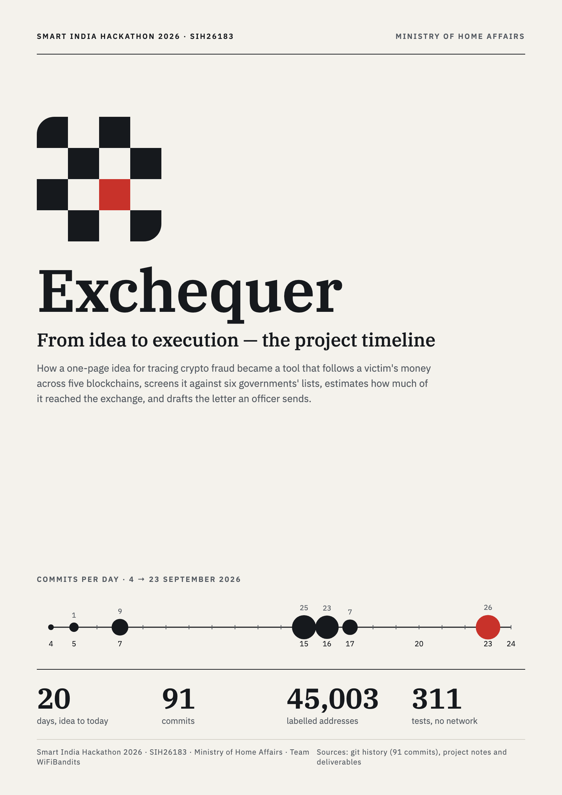
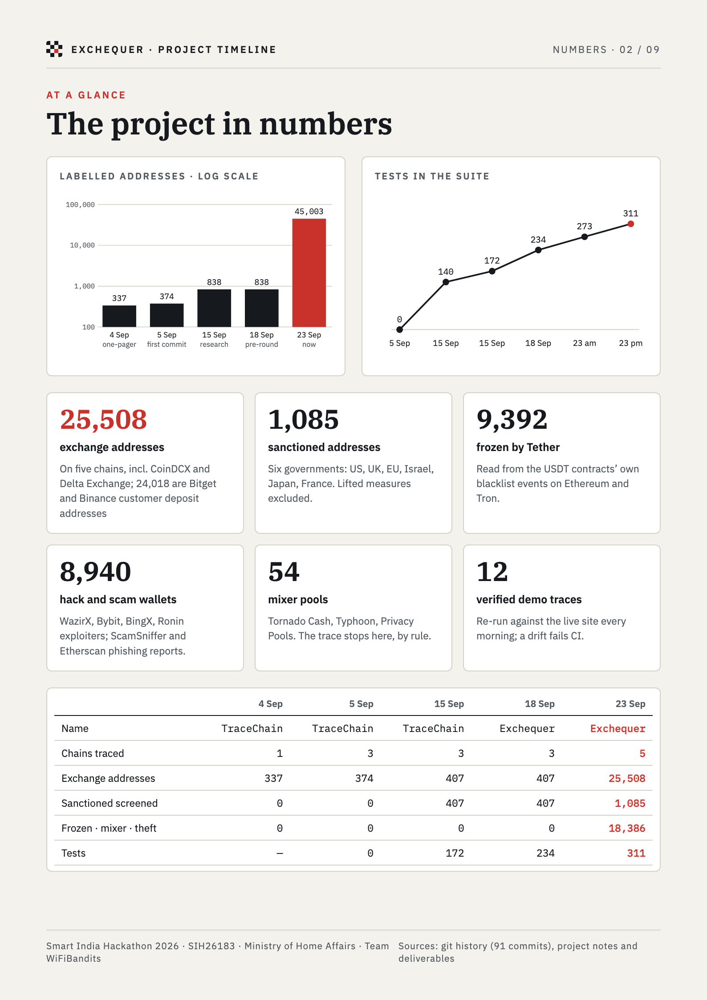
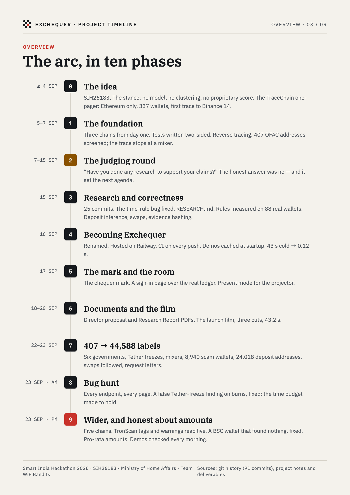
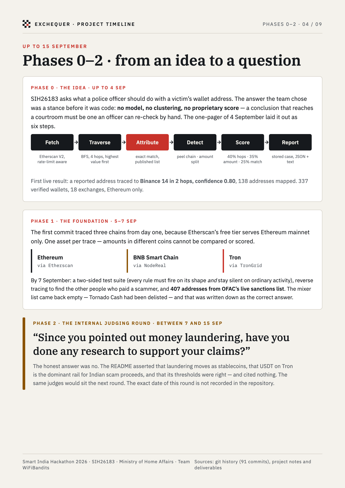
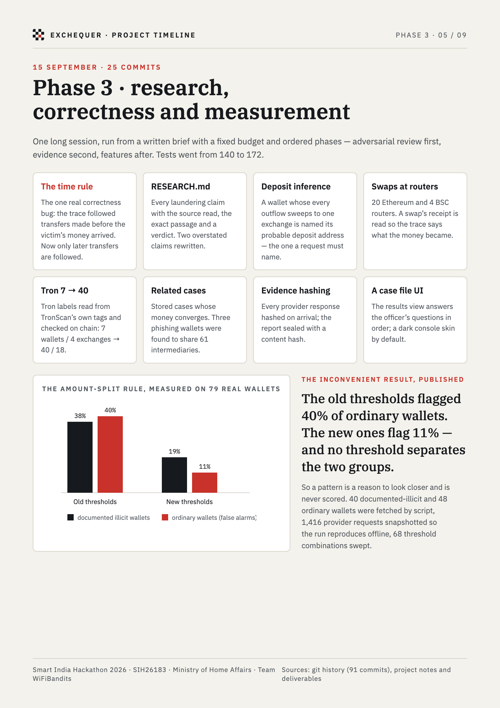
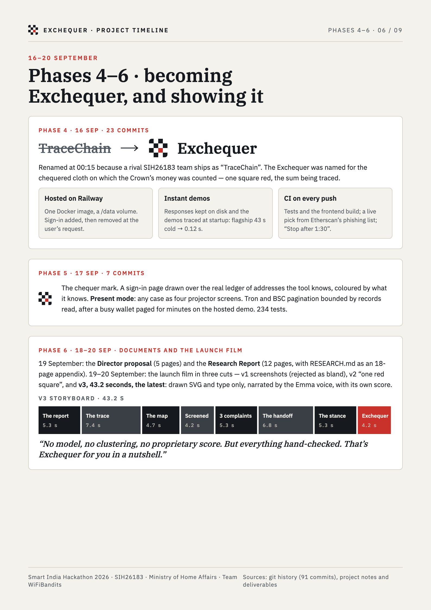
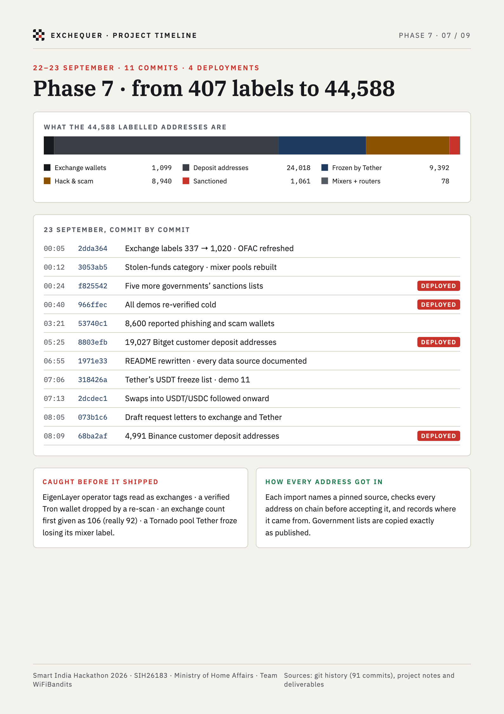
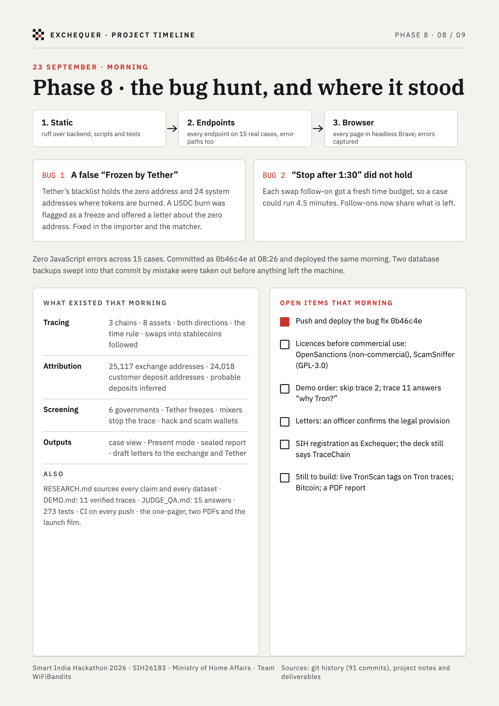
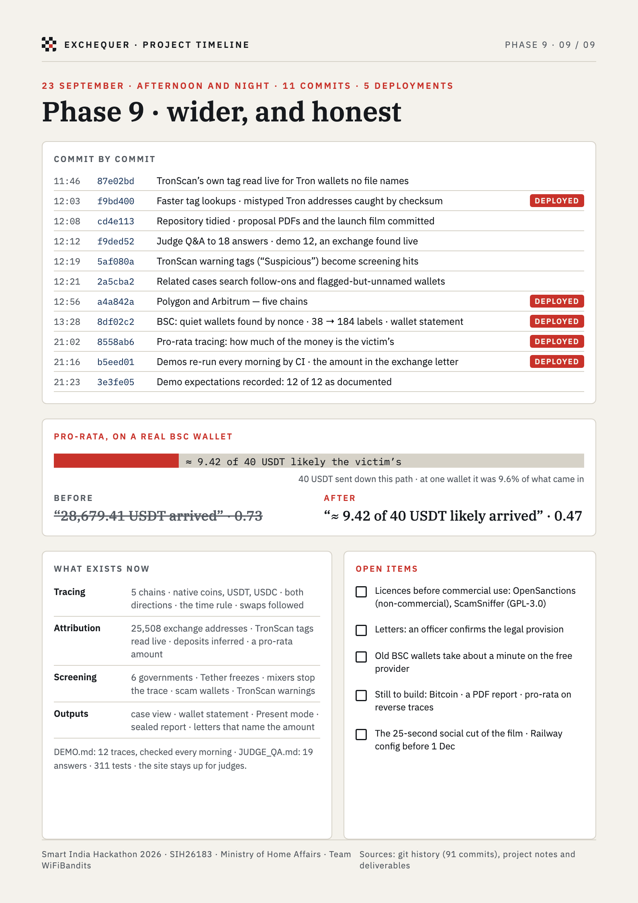

# Exchequer — project timeline (designed version, v2)

The nine A4 pages of [`../Exchequer-Project-Timeline-v2.pdf`](../Exchequer-Project-Timeline-v2.pdf), shown as images
so they display on GitHub. The text version with every date and source is
[`../project-timeline.md`](../project-timeline.md).

---

**Source.** `gen.py` writes the nine pages from the figures in `../project-timeline.md`, and `render.py` prints
the PDF and these images with headless Brave: `python3 gen.py && python3 render.py`. v1 (eight pages, up to
the bug hunt) is kept unchanged in [`../timeline-design/`](../timeline-design/). The `*.dc.html` files and `canvas.json` are in Claude Design's canvas format, so the
pages can be opened there, edited and exported with Export PDF → All artboards.
