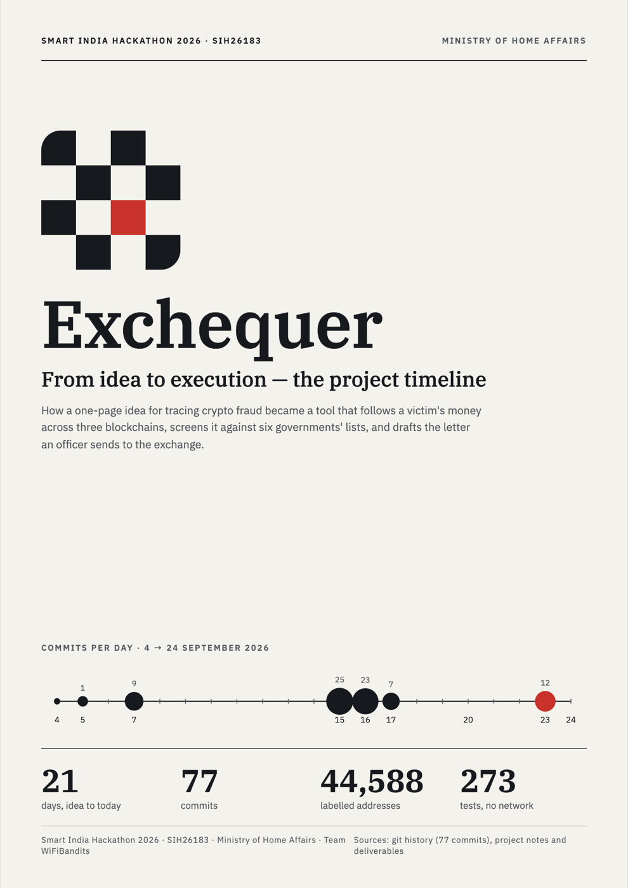
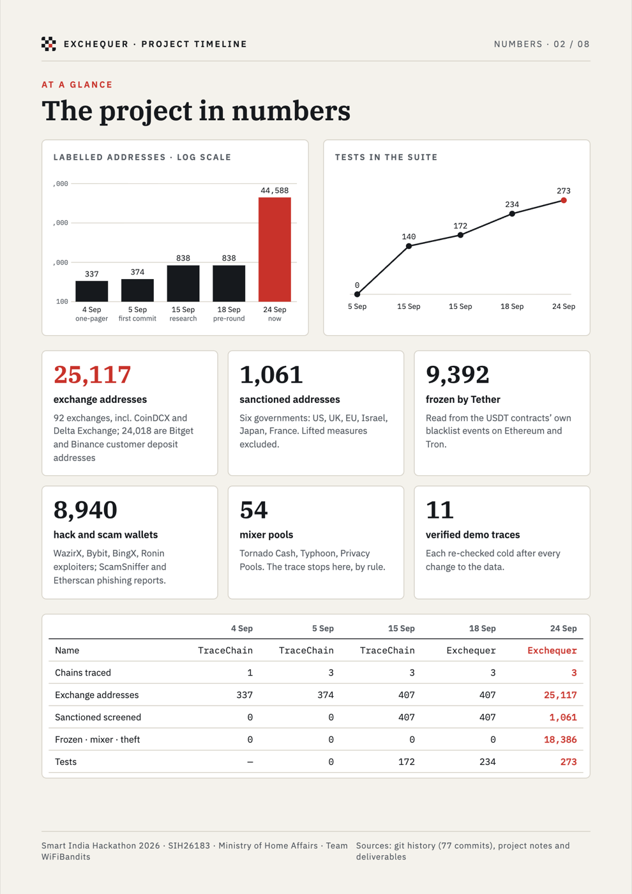
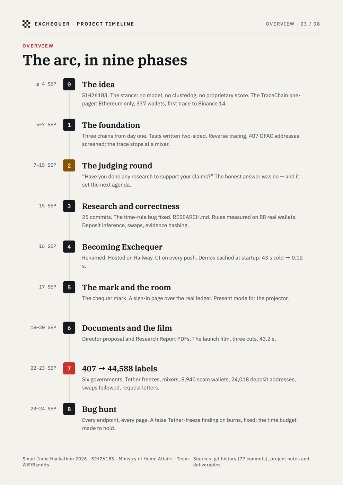
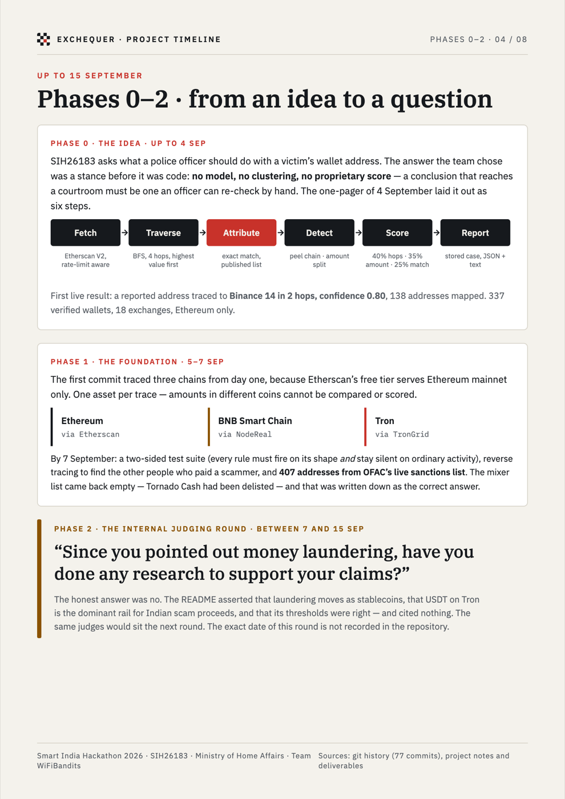
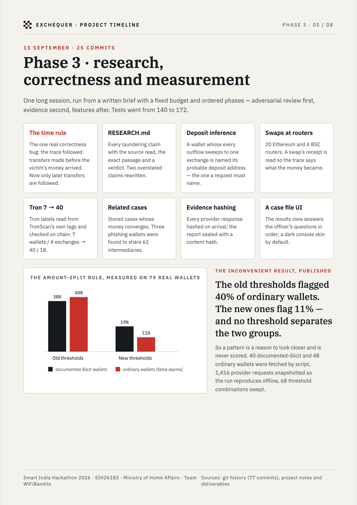
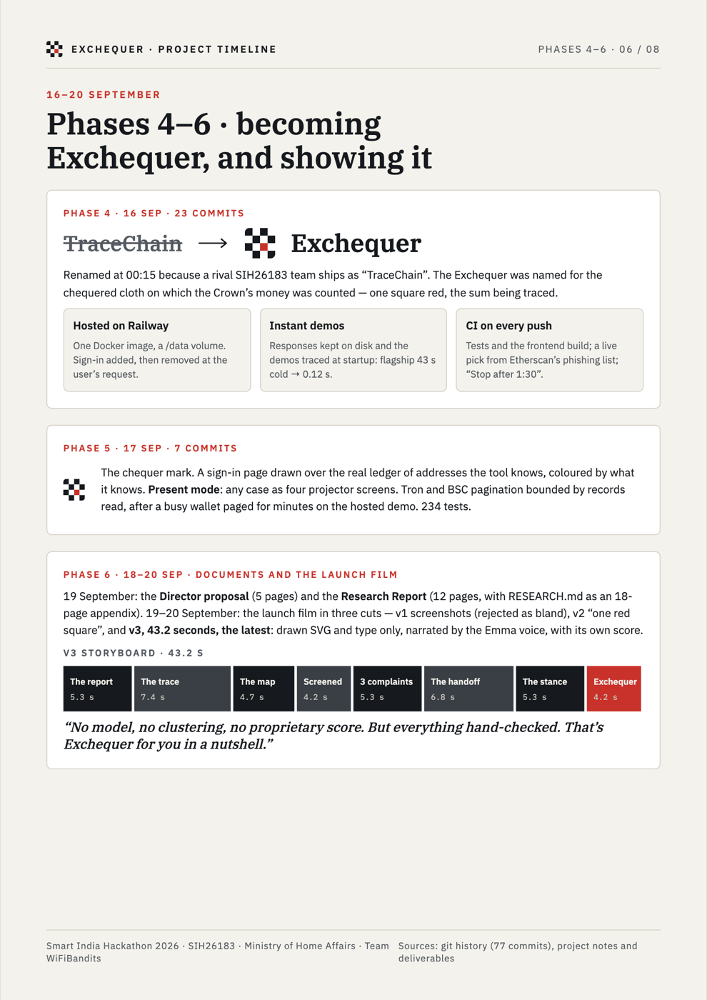
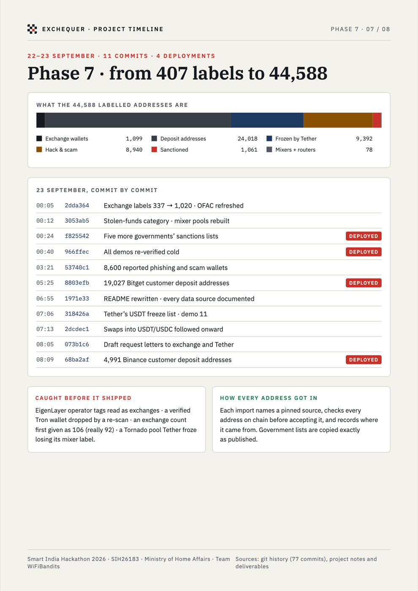
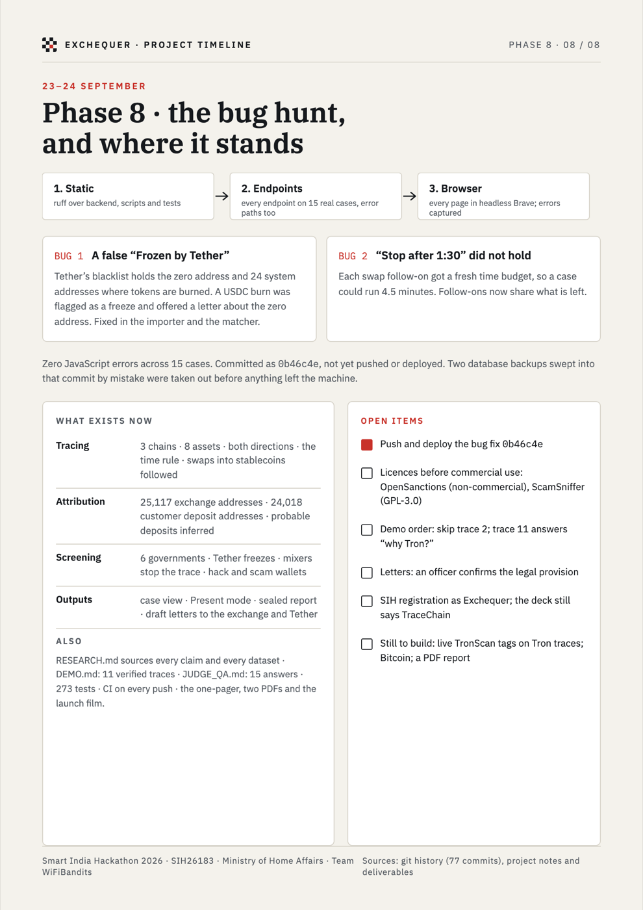

# Exchequer — project timeline (designed version)

The eight A4 pages of [`../Exchequer-Project-Timeline.pdf`](../Exchequer-Project-Timeline.pdf), shown as images
so they display on GitHub. The text version with every date and source is
[`../project-timeline.md`](../project-timeline.md).

---

**Source.** `gen.py` writes the eight pages from the figures in `../project-timeline.md`
(`python3 gen.py` rebuilds them into `project/`). The `*.dc.html` files and `canvas.json` are the
same pages as they sit on the Claude Design canvas, where they can be edited and exported with
Export PDF → All artboards.
